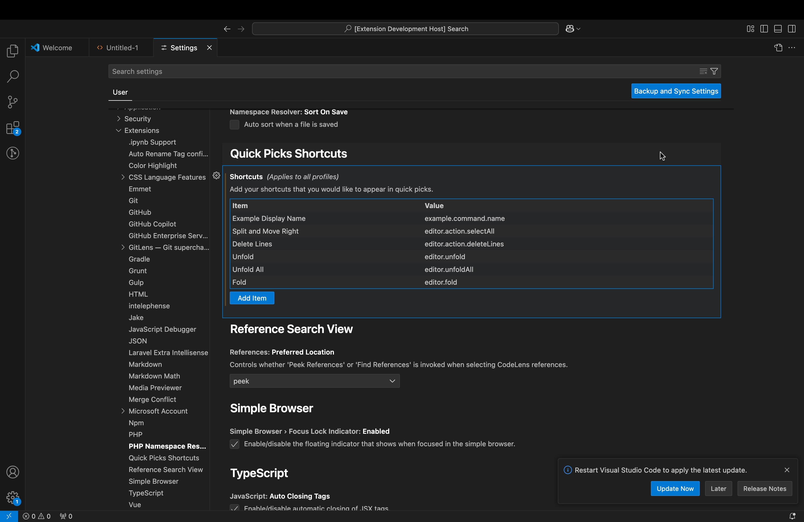
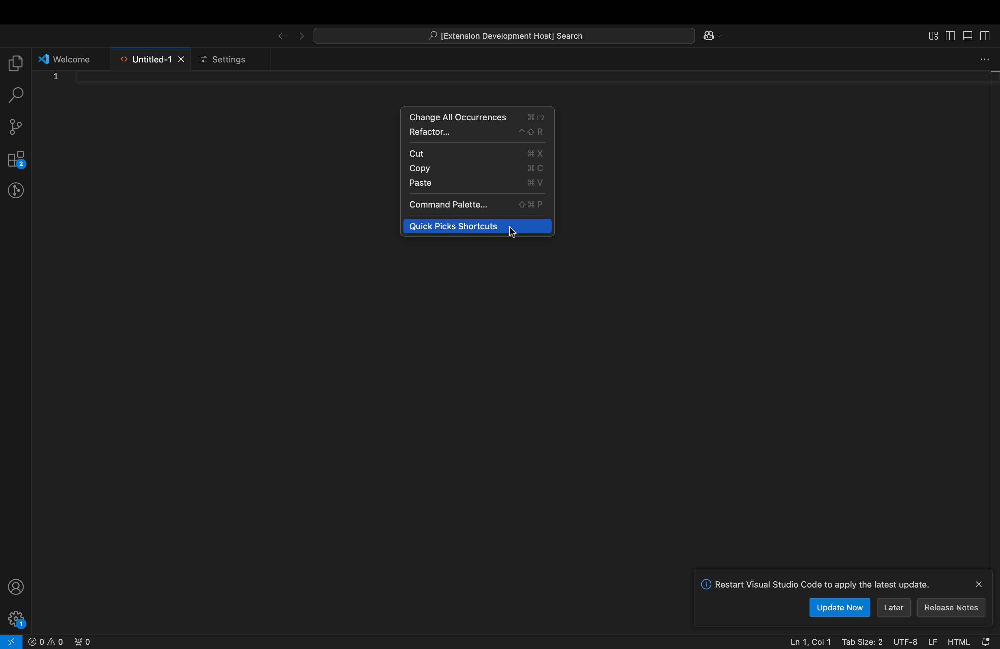
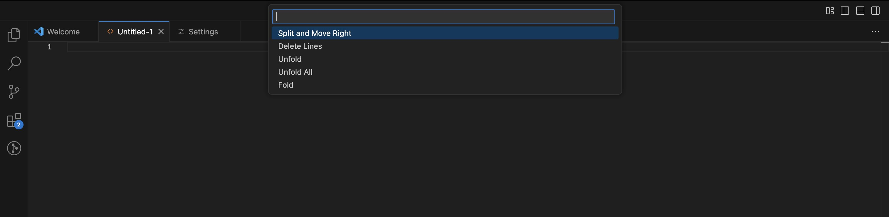

# quick-picks-shortcuts README

Access your favourite vs code shortcuts via quick picks.

## Background

This project was borne out of my frustration with VS Code's complex key bindings for the "fold" and "unfold" commands.

I was looking for a way to simplify my work flow by adding these commands to the context menu thereby accessing them via a simple click action.

Upon doing some research, I found that the only way to add items to the context menu was with a VS Code extension. However it occurred to me that this would be a very limited extension if all it did was to add two items to the context menu.

Therefore, I decided to try make it so that a user could add as many commands as they like.

However the issue I encountered with allowing for user-provided context menu items is that any context menu items that are added by an extension are supposed to be specified within the extension's package.json file. This is a problem because it is difficult to make changes to the package.json at runtime, not to mention the fact that the package.json file is among the files that are submitted when publishing the extension to the VS Code marketplace.

I ended up using a single context menu item that opens quick picks list where the user-provided commands can be displayed, added and removed at runtime.

Further development to this extension is not actively going on but this could change in the future.
Bug fixes will be addessed as soon as possible.

## Features

Access arbitrary VS Code commands via quick picks.

1. Add, Edit or Remove commands from the extension settings area

2. Right click in the editor and click on "Quick Picks Shortcuts"

3. Your commands should be listed in the quick picks and you can click on them to run it.

## Release Notes

### 1.0.0

Initial release.
